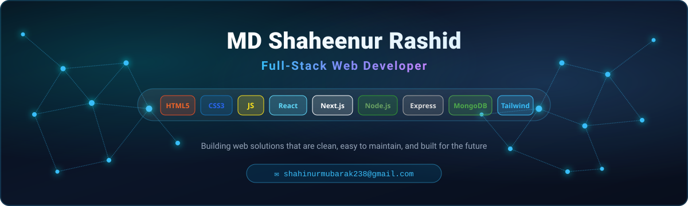

  

<h3 align="center">
  
</h3>

---

## 👨‍💻 About Me

- 🚀 I'm a **Full-Stack Web Developer** based in Bangladesh, passionate about building sleek, responsive, and high-performance web applications.
- 💡 I specialize in modern JavaScript technologies across the frontend and backend, with a strong focus on clean architecture, reusability, and user experience.
- 💻 Proficient in **HTML, CSS, JavaScript, React.js, Next.js, Node.js, Express.js, MongoDB, Mongoose, Tailwind CSS, and DaisyUI**.
- 🎯 **Goal:** To develop scalable, production-ready web solutions and contribute to impactful open-source projects.
- ⚡ **Fun fact:** I love turning complex problems into elegant, maintainable code solutions.

---

## 📌 Current Activity

- 🔭 **Learning & Exploring:** Advanced Next.js Features (App Router, Server Actions), Scalable Backend Architecture & Performance Optimization
- 💼 **Working On:** Full-Stack MERN & Next.js Web Applications
- 🛠️ **Tech Stack:** React.js, Next.js, Node.js, Express.js, MongoDB, Mongoose, Tailwind CSS, DaisyUI
- 🎯 **Goal:** Build production-ready applications with clean code, robust APIs, and optimized performance

---

## 🌐 Connect With Me

  
  
  

---

## 🛠️ Technology Stack

### 🎨 Frontend Development

  
  
  
  
  
  
  

### ⚙️ Backend & Databases

  
  
  
  
  

### 🧰 Tools & Platforms

  
  
  
  
  
  

### 🧩 Other Technologies & Concepts

  
  
  

---

## 📊 GitHub Stats

  
  

---

  
   
  
  

  <i>"Code is like poetry — it should be clean, elegant, and meaningful."</i>

